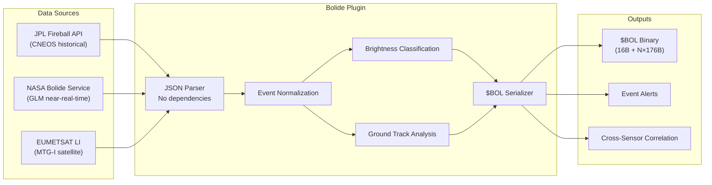
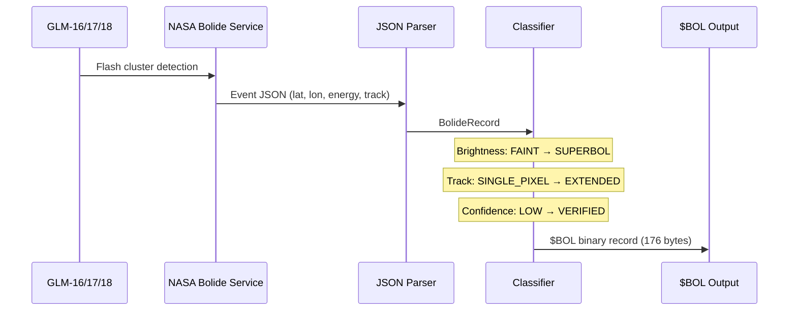

# ☄️ Bolide / Fireball Detection Plugin

[](https://github.com/the-lobsternaut/bolide-sdn-plugin/actions)
[](LICENSE)
[](https://en.cppreference.com/w/cpp/17)
[](https://github.com/the-lobsternaut)

**Near-real-time bolide and fireball detection from NASA's geostationary lightning mappers and JPL's fireball database — tracking meteoric entries with energy, velocity, and ground track analysis.**

---

## Overview

The Bolide plugin consumes data from two NASA sources to detect and characterize meteorite entries into Earth's atmosphere:

1. **JPL Fireball API (CNEOS)** — Historical fireball events with calibrated energy, entry velocity vectors, and location data from U.S. government sensors
2. **NASA Bolide Detection Service (GLM)** — Near-real-time detections from Geostationary Lightning Mapper sensors (GLM-16, GLM-17, GLM-18) and EUMETSAT Lightning Imager, with brightness, duration, ground tracks, and confidence scoring

Output is a compact `$BOL` binary format with 176-byte records containing location, energy (optical + impact), entry velocity, brightness classification, ground track, and sensor provenance.

### Why It Matters

Bolide events are the most visible intersection of the space environment with Earth. Large fireballs like Chelyabinsk (2013, ~500 kt) demonstrate the need for rapid detection and characterization. This plugin enables automated monitoring of the near-Earth environment, distinguishing between natural bolides and potential artificial reentry events.

---

## Architecture



### Detection Pipeline



---

## Data Sources & APIs

| Source | URL | Auth | Update Frequency |
|--------|-----|------|-----------------|
| **JPL Fireball API** | [ssd-api.jpl.nasa.gov/fireball.api](https://ssd-api.jpl.nasa.gov/fireball.api) | None | Daily |
| **NASA Bolide Service** | [neo-bolide.ndc.nasa.gov/service/event/public](https://neo-bolide.ndc.nasa.gov/service/event/public) | None | Near-real-time |
| **GOES GLM** | via NASA Bolide Service | None | Continuous |

---

## Research & References

- Brown, P. G. et al. (2002). ["The flux of small near-Earth objects colliding with the Earth"](https://doi.org/10.1038/nature01238). *Nature*, 420, 294–296. Bolide flux estimates from satellite data.
- Jenniskens, P. et al. (2018). ["Detection of meteoroid impacts by the Geostationary Lightning Mapper on the GOES-16 satellite"](https://doi.org/10.1111/maps.13137). *Meteoritics & Planetary Science*, 53(12), 2445–2469. Primary reference for GLM bolide detection methodology.
- Brown, P. G. et al. (2013). ["A 500-kiloton airburst over Chelyabinsk and an enhanced hazard from small impactors"](https://doi.org/10.1038/nature12741). *Nature*, 503, 238–241. Chelyabinsk event analysis.
- **CNEOS Fireball Database** — [cneos.jpl.nasa.gov/fireballs](https://cneos.jpl.nasa.gov/fireballs/). NASA/JPL Center for Near Earth Object Studies.
- Tagliaferri, E. et al. (1994). "Detection of meteoroid impacts by optical sensors in Earth orbit." *Hazards due to Comets and Asteroids*, 199–220.
- **GOES-R Series GLM** — [goes-r.gov/spacesegment/glm.html](https://www.goes-r.gov/spacesegment/glm.html). Geostationary Lightning Mapper instrument specification.

---

## Technical Details

### Wire Format: `$BOL`

```
┌──────────────────────────────────────────────┐
│ BolHeader (16 bytes)                         │
│  magic[4]   = "$BOL"                         │
│  version    = uint32 (currently 1)           │
│  source     = uint32 (DataSource enum)       │
│  count      = uint32 (number of records)     │
├──────────────────────────────────────────────┤
│ BolideRecord[0] (176 bytes)                  │
│  epoch_s (f64)        — peak brightness time │
│  lat_deg, lon_deg (f64×2) — location         │
│  alt_km (f64)         — altitude             │
│  vx/vy/vz_kms (f64×3)— entry velocity       │
│  speed_kms (f64)      — total speed          │
│  radiated_energy_J (f64) — optical energy    │
│  impact_energy_kt (f64)  — total energy [kt] │
│  brightness_W (f64)  — peak brightness       │
│  ... duration, track points, sensors ...     │
├──────────────────────────────────────────────┤
│ BolideRecord[1] ...                          │
└──────────────────────────────────────────────┘
```

### Brightness Classification

| Class | Code | Description |
|-------|------|-------------|
| FAINT | 1 | Barely detectable by GLM |
| MODERATE | 2 | Clearly visible, well-resolved |
| BRIGHT | 3 | Detector saturation likely |
| SUPERBOL | 4 | > 0.1 kt impact energy (Chelyabinsk-class and above) |

### Ground Track Types

| Type | Code | Description |
|------|------|-------------|
| SINGLE_PIXEL | 1 | Point detection, no track resolved |
| MULTI_PIXEL | 2 | Resolved trajectory across multiple pixels |
| EXTENDED | 3 | Long trajectory > 100 km ground track |

### Confidence Levels

| Level | Code | Meaning |
|-------|------|---------|
| LOW | 1 | May be lightning or sensor artifact |
| MEDIUM | 2 | Likely bolide based on temporal/spatial signature |
| HIGH | 3 | Confirmed bolide from single sensor |
| VERIFIED | 4 | Cross-validated with multiple sensors or independent reports |

### Energy Conversion

Impact energy (kilotons TNT) is estimated from optical radiated energy using empirical calibration:
- 1 kiloton TNT = 4.185 × 10¹² J
- Optical efficiency factor typically 5–15% of total kinetic energy

---

## Input/Output Format

### Input

| Format | Source | Description |
|--------|--------|-------------|
| `application/json` | JPL Fireball API | Array of fireball events with energy, velocity, location |
| `application/json` | NASA Bolide Service | GLM event detections with brightness and track data |

### Output

| Format | ID | Description |
|--------|-----|-------------|
| `$BOL` | Binary | Packed header (16B) + N × BolideRecord (176B) |

---

## Build Instructions

```bash
git clone --recursive https://github.com/the-lobsternaut/bolide-sdn-plugin.git
cd bolide-sdn-plugin

mkdir -p build && cd build
cmake ../src/cpp -DCMAKE_CXX_STANDARD=17
make -j$(nproc)
ctest --output-on-failure
```

---

## Usage Examples

### Parse JPL Fireball Data

```cpp
#include "bolide/parser.h"

std::string json = /* fetch from ssd-api.jpl.nasa.gov/fireball.api */;
auto events = bolide::parseFireballAPI(json);

for (const auto& event : events) {
    printf("Bolide: %.1f°N %.1f°E, energy=%.3f kt, speed=%.1f km/s\n",
           event.lat_deg, event.lon_deg, 
           event.impact_energy_kt, event.speed_kms);
}
```

### Serialize to $BOL

```cpp
auto buffer = bolide::serializeBolides(events, bolide::DataSource::CNEOS_FIREBALL);
// buffer.size() == 16 + events.size() * 176 bytes
```

### Filter Superbölides

```cpp
std::vector<bolide::BolideRecord> superbolides;
for (const auto& r : events) {
    if (r.brightness_class == static_cast<uint8_t>(bolide::BrightnessClass::SUPERBOL)) {
        superbolides.push_back(r);
    }
}
```

---

## Dependencies

| Dependency | Version | Purpose |
|-----------|---------|---------|
| C++17 compiler | GCC 7+ / Clang 5+ | Core language standard |
| CMake | ≥ 3.14 | Build system |

> **Zero external library dependencies.** JSON parsing is hand-rolled for the specific API formats.

---

## Plugin Manifest

```json
{
  "schemaVersion": 1,
  "name": "bolide-detector",
  "version": "0.1.0",
  "description": "Bolide/fireball detection and analysis — consumes JPL Fireball API (CNEOS) and NASA GLM Bolide Service data.",
  "author": "DigitalArsenal",
  "license": "Apache-2.0",
  "inputFormats": ["application/json"],
  "outputFormats": ["$BOL"],
  "dataSources": [
    {
      "name": "JPL Fireball API",
      "url": "https://ssd-api.jpl.nasa.gov/fireball.api",
      "type": "REST",
      "auth": "none"
    },
    {
      "name": "NASA Bolide Service",
      "url": "https://neo-bolide.ndc.nasa.gov/service/event/public",
      "type": "REST",
      "auth": "none"
    }
  ]
}
```

---

## Project Structure

```
bolide/
├── plugin-manifest.json
├── README.md
└── src/
    └── cpp/
        ├── CMakeLists.txt
        ├── include/
        │   └── bolide/
        │       ├── types.h       # Wire format, enums, BolideRecord
        │       └── parser.h      # JPL Fireball & NASA GLM JSON parsers
        └── tests/
            └── test_bolide.cpp
```

---

## License

Apache-2.0 — see [LICENSE](LICENSE) for details.

---

*Part of the [Space Data Network](https://github.com/the-lobsternaut) plugin ecosystem.*
